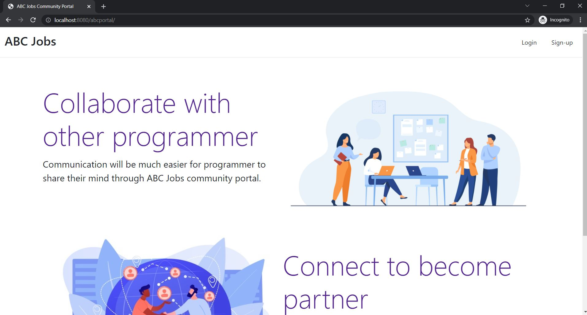
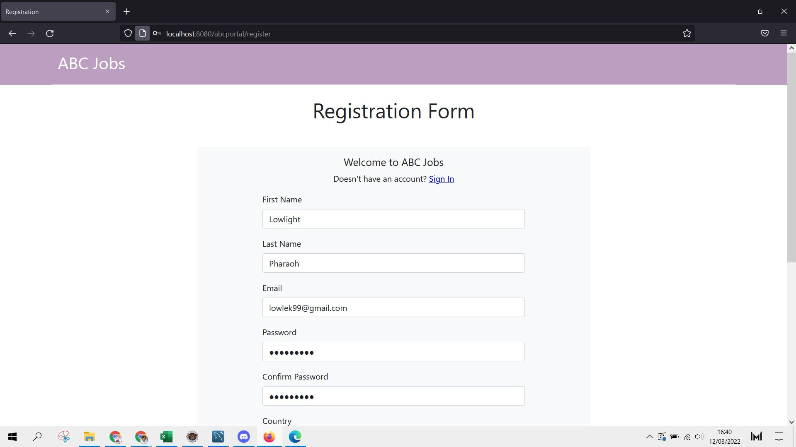
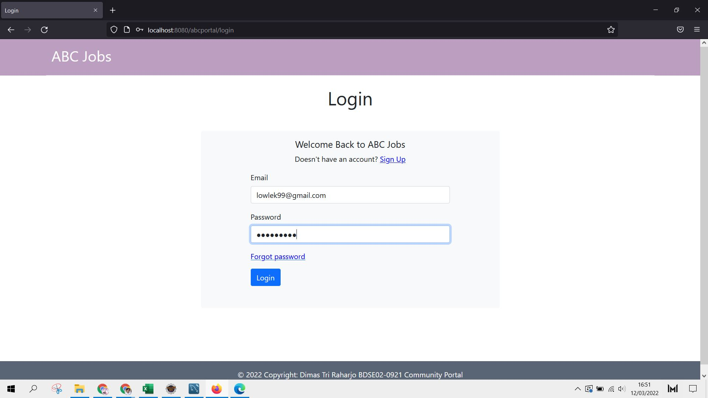
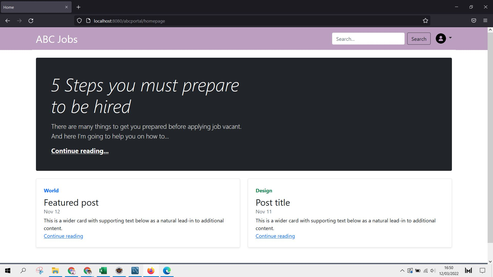
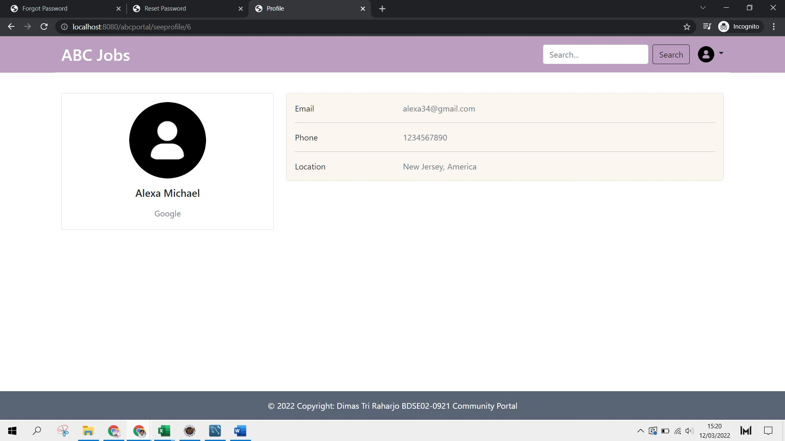
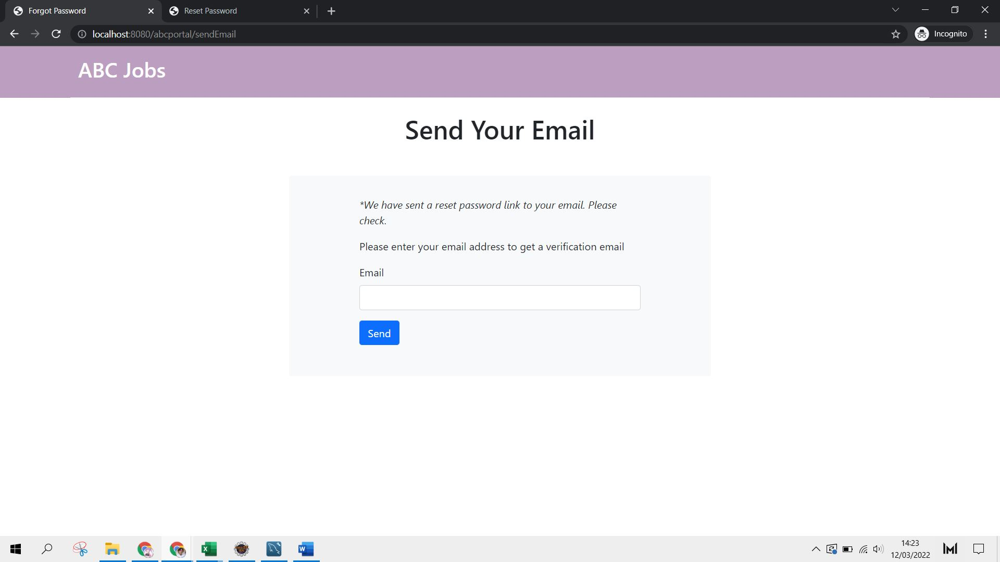
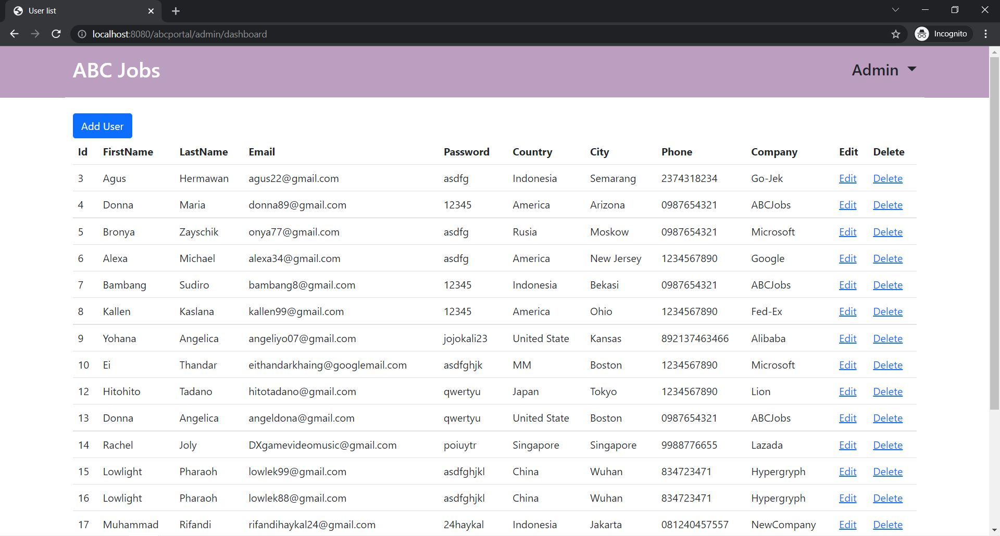

# Community-Portal
BRIEF DESCRIPTION   
Web app of ABC Jobs Community Portal with Spring MVC. A portal for developers to interact and job finding

OVERVIEW  
There are 2 types of users in this Community portal. They are
<ol>
  <li>Software Programmer</li>
  <li>Administrator</li>
</ol>
Software Programmer should be able to perform following functions in the portal
<ul>
  <li>Allow the programmers to register in the portal and show a thank you page.</li>
  <li>Search & Find Other Programmers and view their profile after login.</li>
  <li>Provide Login and logout functionality.</li>
  <li>Update their Profile after logging in.</li>
</ul>
Administrator should be able to perform following functions in the portal
<ul>
  <li>Administer user (see list of users, add new user, edit existing user data, and delete existing user).</li>
</ul>

TECHNOLGIES USED & SYSTEM REQUIREMENTS    
Backend: Java SE 1.8, Spring MVC  
Frontend: JSP, HTML 5, CSS, JavaScript, Bootstrap 5   
Web Server: Apache Tomcat 9   
DBMS: MySQL 8.0.27    
OS: Windows 10    
IDE: Eclipse 2021 

Note*   
Different version can be use but keep in mind to change the configuration / settings too in related place. Use the Recommend above to avoid unnecessary error.

HOW TO RUN    
- Have a Java Installed in the computer
- Have Apache Tomcat Server ready in the IDE
- Import the 'abcportal' folder to the IDE. Do maven update!
- Create new database in MySQL with same name mention in the persistence.xml (Could be change to your preference)
- Run the application in server

PREVIEW SOME SCREENSHOT    

